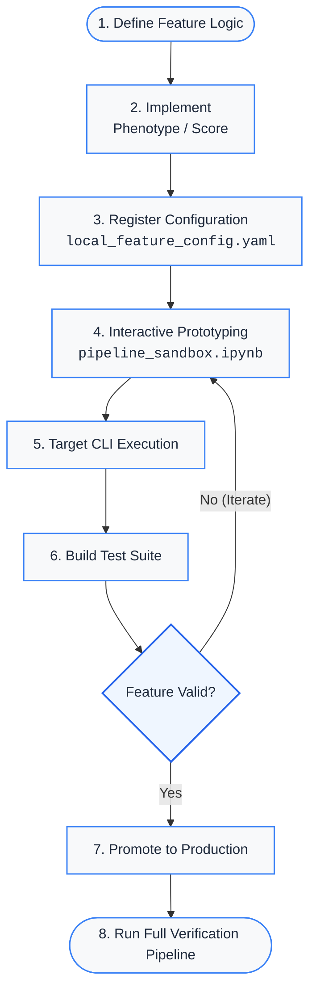

# Local Feature & Score Development

This guide outlines the workflow for creating, prototyping, debugging, and testing custom 
clinical features or risk scores locally within your repository before promoting them to 
the core codebase.

The recommended approach is to keep experimental logic and configuration separate from 
production code while you develop and validate your feature. Once the feature is stable 
and validated, it can be promoted into the main pipeline.

---

## 1. Recommended Local Directory Structure

To keep your experimental logic separate from production code, maintain a clean separation for 
your local overrides. This allows you to iterate on new features without modifying the production 
phenotype module or the master feature configuration.

```text
local/
|── __init__.py
├── config/
│   |── local_data_config.yaml
│   └── local_feature_config.yaml
├── features/
│   |── __init__.py
│   └── stress.py                    # Stress related phenotypes implementation.
├── scores/
│   |── __init__.py
│   └── triage.py                    # Triage scores python implementation.
├── tests/
│   |── __init__.py
│   └── test_local_logic.py          # Unit test suite for local phenotypes and scores.
└── notebooks/
    └── pipeline_sandbox.ipynb       # Interactive prototyping notebook
```

---

## 2. Step-by-Step Workflow

### Step A: Write Your Custom Logic

Create or edit your local module, for example:

```text
local/features/stress.py
```

Write your feature extraction function in this module.

The function should accept the primary DataFrame and `**kwargs`, including any 
contextual DataFrames that may be required by more complex features.

??? example "View Code: `local/features/stress.py`"

    ```python
    # local/features/stress.py

    import pandas as pd
    import numpy as np


    def derive_local_stress(
        df: pd.DataFrame,
        hr_col: str = "HR",
        temp_col: str = "Temp",
        **kwargs,
    ) -> np.ndarray:
        """
        Derive a local physiological stress phenotype from vital sign observations.

        Identifies patients meeting criteria for combined tachycardia and hyperthermia.
        Flags each record as positive (1) when both heart rate exceeds 100 bpm and body
        temperature exceeds 38.0°C; otherwise flags as negative (0). Missing values or
        unparseable observations are coerced to NaN and evaluated as negative.

        Parameters
        ----------
        df : pd.DataFrame
            Input dataset containing patient clinical measurements.
        hr_col : str, default 'HR'
            Column name in `df` representing heart rate observations (in bpm).
        temp_col : str, default 'Temp'
            Column name in `df` representing body temperature observations (in °C).
        **kwargs : dict
            Additional keyword arguments passed from the pipeline execution engine.

        Returns
        -------
        np.ndarray
            Binary array of shape `(n_samples,)` where `1` indicates the presence of
            the stress phenotype and `0` indicates absence.

        Examples
        --------
        >>> import pandas as pd
        >>> data = pd.DataFrame({"HR": [80, 110, 120], "Temp": [37.0, 38.5, 36.5]})
        >>> derive_local_stress_phenotype(data)
        array([0, 1, 0])
        """
        # Start by assuming the condition is absent (0)
        flag = pd.Series(0, index=df.index, dtype=int)

        # Safely evaluate if the required columns exist
        if hr_col in df.columns and temp_col in df.columns:
            hr = pd.to_numeric(df[hr_col], errors="coerce")
            temp = pd.to_numeric(df[temp_col], errors="coerce")

            # Apply the clinical logic: tachycardia (>100 bpm) AND pyrexia (>38.0 °C)
            flag.loc[(hr > 100) & (temp > 38.0)] = 1

        return flag.values
    ```

!!! tip "Standardized Docstrings for Production"
    The docstring style shown above serves as a template. Following this format ensures clear 
    documentation for local development and allows `mkdocstrings` to automatically build your 
    API documentation once the code is integrated into production.

---

### Step B: Register It in Your Local Config

Add your new feature to:

```text
local/config/local_feature_config.yaml
```

under `custom_features`:

```yaml
# config/local_feature_config.yaml

custom_features:
  local_stress_flag:
    module: "local.features.stress"
    function: "derive_local_stress"
    kwargs:
      hr_col: "hr"
      tamp_col: "temp"
```

The configuration connects the feature name used by the pipeline to the Python module 
and function that implement it. You can also use `kwargs` to expose parameters that you 
want to adjust during experimentation without modifying the Python function itself.


---

### Step C: Execute Only Your Feature

You do not need to rebuild every feature during development.

Instead, execute only your experimental phenotype using the `--only` option.

```bash
> icare-risk-features \
    --feature-config config/local_feature_config.yaml \
    --only local_stress_flag
```

## 3. Prototyping & Interactive Testing

When actively writing and tweaking a feature that relies on complex relational tables, such 
as microbiology or pharmacy contexts, it might be better to use an interactive notebook:

```text
notebooks/pipeline_sandbox.ipynb
```

This workflow allows you to mock lightweight datasets in memory, write new score definitions, 
and test them against core utilities provided by the icare_risk package without running the 
full pipeline after every change.

### Option I: Simple Interactive Sandbox
Create minimal test data and use built-in package utilities to
verify your scoring logic.

??? example "View Code: `Simple Notebook Example`"

    ```python
    # ---------------------------------------------------------------------
    # Developing: Interactive Notebook Sandbox
    # ---------------------------------------------------------------------
    import numpy as np
    import pandas as pd
    from icare_risk.scores import evaluate_score
    
    # 1. Create a minimal mock DataFrame with the required test columns
    df_test = pd.DataFrame(
        {
            "patient_id": [1, 2, 3, 4],
            "AGE_AT_ADMISSION": [45, 72, 80, 55],
            "local_stress_flag": [0, 1, 1, 0],
        }
    )
    
    
    # 2. Define your experimental scoring logic using icare_risk scoring rules
    def calculate_experimental_score(
        df: pd.DataFrame,
        age_col: str = "AGE_AT_ADMISSION",
        stress_col: str = "local_stress_flag",
    ) -> pd.Series:
        rules = [
            {
                "desc": "Elderly",
                "col": age_col,
                "condition": df[age_col] > 65,
                "points": 2,
            },
            {
                "desc": "Stressed",
                "col": stress_col,
                "condition": df[stress_col] == 1,
                "points": 3,
            },
        ]
    
        # Use existing icare_risk evaluation helpers (verbose=True outputs full audit logs)
        return evaluate_score(df, rules, score_name="EXPERIMENTAL", verbose=True)
    
    
    # 3. Test and inspect the results immediately
    df_test["new_score"] = calculate_experimental_score(df_test)
    display(df_test)
    ```

!!! tip "Leverage Built-In Package Functions"
    Rather than rewriting scoring or parsing logic from scratch, import utility functions 
    and standard phenotypes directly from icare_risk to ensure consistency with the production 
    pipeline.

### Option II: Complex Interactive Sandbox

This allows you to test the feature against real data without running the complete 
feature-building script after every change.

#### A. Load the Data

Set up the notebook environment at the project root, load base and local configuration 
files, and automatically locate the latest dataset. Then ingest raw patient episodes, 
vital signs, and lab results, combining them into a unified time-series DataFrame (`df_ts`) 
for testing.

??? example "View Code"

    ```python
    # ----------------------------------------------------
    # Developing: Complex notebook setup
    # ----------------------------------------------------
    
    import os
    import pandas as pd
    from pathlib import Path
    
    # -----------------------
    # Temporal fix
    # -----------------------
    # Might be better to enable exact dir in get_lated_data_dir(exact_dir=....).
    # If running inside the 'notebooks' folder, step back up to the project root
    if Path.cwd().name == 'notebooks':
        os.chdir('..')
        print(f"📂 Changed working directory to project root: {Path.cwd()}")
    else:
        print(f"📂 Working directory: {Path.cwd()}")
    
    # -----------------------
    # Step 1
    # -----------------------
    
    # Import your core tools
    from icare_risk.utils import load_yaml_config, get_latest_data_dir
    from icare_risk.features import FeaturePipeline
    from icare_risk.scripts.b_build_features_icare import (
        prepare_icare_ts,
        LazyContextDict
    )
    
    # 1. Load Configs
    data_config = load_yaml_config("data_config.yaml")
    # Load your local override containing the feature you want to test!
    feat_config = load_yaml_config("feature_config.yaml", "../config/local_feature_config.yaml")
    
    # 2. Get Real Data Directory
    latest_dir = get_latest_data_dir(loaded_config=data_config)
    print(f"Using data from: {latest_dir.name}")
    
    # 3. Load Base Data
    df_episodes = pd.read_csv(latest_dir / 'icare_episodes_anon.csv') \
        .rename(columns={'SUBJECT': 'patient_id'})
    df_vitals = pd.read_csv(latest_dir / 'icare_vital_signs_anon.csv', 
        parse_dates=['OBSERVATION_PERFORMED_DT'])
    df_labs = pd.read_csv(latest_dir / 'icare_pathology_blood_anon.csv', 
        parse_dates=['SAMPLE_COLLECTED_DT'])
    
    df_ts = prepare_icare_ts(df_vitals, df_labs, data_config)
    ```

#### B. Set Up Lazy Contexts

If the feature requires additional relational tables, configure them using `LazyContextDict`.

??? example "View Code"

    ```python
    # 4. Initialize the Lazy Contexts (The Magic Part)
    contexts = LazyContextDict({
        'microbiology': latest_dir / 'icare_microbiology_anon.csv',
        'pharmacy': latest_dir / 'icare_pharmacy_prescribing_anon.csv',
        'problems': latest_dir / 'icare_problems_anon.csv',
        'diagnoses': latest_dir / 'icare_episodes_diagnosis_anon.csv'
    })
    ```


#### C. Test the Feature Interactively

Create your own feature

??? example "View Code"

    ```python
    def test_random_feature(df, **kwargs):
        """Generates a random binary flag (0 or 1) for each row."""
        np.random.seed(kwargs.get('seed', 42))
        return np.random.randint(0, 2, size=len(df))

    # Run it in your notebook
    df_ts['random_test_flag'] = test_random_feature(df_ts, seed=123)
    display(df_ts[['patient_id', 'date', 'random_test_flag']].head(5))
    ```

Or import your local feature and run it directly against the prepared time-series DataFrame

??? example "View Code"

    ```python
    from icare_risk.local_phenotypes import derive_local_stress

    df_ts['local_stress_flag'] = derive_local_stress(
        df_ts, hr_col='hr', temp_col='temp
    )
    
    display(df_ts['patient_id', 'date', 'hr', 'temp', 'local_stress_flag']].head(10))
    ```


This gives you a fast feedback loop for checking:

* Whether the required columns are available.
* Whether the feature produces the expected values.
* Whether missing values are handled correctly.
* Whether thresholds and parameters behave as expected.
* Whether the resulting feature aligns with the intended clinical logic.

---

## 4. Targeted Debugging with the Pipeline (`--only`)

Once your function works as expected in the notebook, verify how it integrates with 
the full feature pipeline. Instead of waiting for every feature and score to be generated, 
use the target isolation flag (as discussed before).

#### Running Single Feature

```bash
> icare-risk-features \
    --feature-config config/local_feature_config.yaml \
    --only local_stress_flag
```

#### Running Multiple Target Features Simultaneously

If you want to test your local feature alongside an existing score, such as 
checking `local_stress_flag` alongside `pitt_score`, comma-separate the targets:

```bash
> icare-risk-features \
    --feature-config config/local_feature_config.yaml \
    --only local_stress_flag,pitt_score
```

---

## 5. Creating tests

---

## 6. Promotion to Production

Once your local feature passes validation checks and performs as expected, promote it into the core production codebase.

### Step 1: Migrate Files & Configurations

Transfer your local implementation, YAML configuration block, and unit tests into their corresponding production paths:

| Component         | Local Source Path                 | Production Target Path              |
|:------------------|:----------------------------------|:------------------------------------|
| **Phenotypes**    | `local/features/<name>.py`        | `src/icare_risk/phenotypes.py`      |
| **Scores**        | `local/scores/<name>.py`          | `src/icare_risk/scores.py`          |
| **Configuration** | `config/<name>.yaml`              | `src/icare_risk/config/<name>.yaml` |
| **Unit Tests**    | `local/tests/test_local_logic.py` | `tests/test_<name>.py`              |

!!! warning "Enforce Production Naming Conventions"
    Ensure functions and identifiers strictly follow production conventions before merging.
    For **phenotypes** use standard prefixes such as `derive_<phenotype>`, `has_<phenotype>`, 
    `is_<phenotype>`, or `hx_<phenotype>` and for **scores** use standard prefixes like 
    `calculate_<score>`.

### Step 2: Run the Full Pipeline

After promoting the feature, run the complete, unconditioned pipeline build:

Running the full pipeline is important because a feature that works correctly 
in isolation may still interact with other features, scores, context tables, 
or pipeline stages in unexpected ways.

---

## 6. Recommended Development Cycle

The overall workflow follows an iterative feedback loop from initial prototyping to production promotion:



---

## Quick Reference

